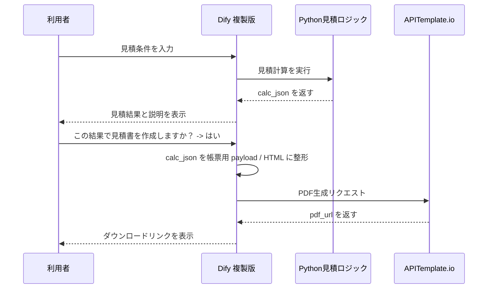
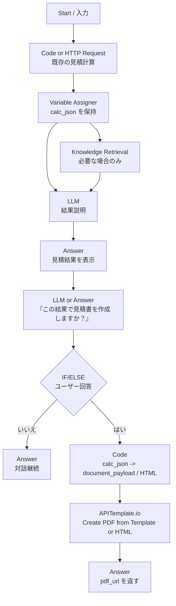

# Dify 複製版での簡易見積書出力プラン

## 目的

既存の Dify 見積アプリはそのまま維持し、複製した別バージョンで簡易見積書の出力を試す。

この方針にする理由:

- 既存の見積デモをデグレさせない
- `calc_json` を返す現在の安定構成を壊さない
- 帳票化まわりの失敗を本体から切り離せる
- 発表用に「現行版」と「帳票化試作版」を分けて説明しやすい

## 方針

### 守るべき境界

- `calc_json` は事実の正本とする
- Dify は結果表示と追加質問を担う
- 見積書は、ユーザーが明示的に確定した時点の `calc_json` からのみ生成する
- LLM は帳票の数値や内訳を生成しない
- PDF の見た目はテンプレートまたは HTML で固定する

### 今回の狙い

最初から正式見積書を目指さず、以下の最低限を満たす簡易見積書を作る。

- 案件名
- 発行日
- 合計金額
- フェーズ別内訳
- 前提条件
- 注意書き

## シーケンス



## ノード配線図

複製版の Dify Workflow は、既存の見積フローを起点に後段だけ足す。



## ノードごとの役割

### 1. 既存の見積計算ノード

そのまま使う。ここで返すものは最低限以下。

- `calc_json`
- `query_for_rag`

### 2. Variable Assigner

`calc_json` を会話中に保持する。帳票化処理ではこの値だけを使う。

保持したい主な値:

- `calc_json`
- 必要なら `query_for_rag`

### 3. LLM / Answer

現行どおり見積結果の説明に使う。

ここでのルール:

- 金額や内訳の新規生成は禁止
- 根拠は `calc_json` と RAG 文書に限定

### 4. 確認ステップ

見積書化は明示的な確定操作にする。

表示例:

- `この結果で簡易見積書を作成しますか？`
- `はい`
- `いいえ`

### 5. 帳票用整形ノード

`calc_json` を APITemplate.io に渡せる形へ変換する。

この整形は LLM ではなくコードで行う。

### 6. APITemplate.io ノード

最初は以下のどちらかで始める。

- `Create PDF from HTML`
- `Create PDF from Template`

最初の試作は `Create PDF from HTML` の方が早い。見た目が固まってから Template に寄せる。

### 7. 最終 Answer

返すもの:

- PDF ダウンロード案内
- 必要なら `pdf_url`

## 必要な新規コード

今回新たに必要なのは、見積計算ロジックの再設計ではなく、`calc_json` を帳票用データへ変換する薄いアダプタである。

### A. document_payload 生成コード

役割:

- `calc_json` から見積書に載せる項目だけを抜き出す
- 金額表記を整える
- 日付や注意書きを足す

想定する出力例:

```json
{
  "estimate_title": "簡易見積書",
  "issued_date": "2026-03-23",
  "project_name": "ECサイト刷新",
  "client_name": "サンプル株式会社",
  "total_cost_label": "3,200,000円",
  "breakdown_rows": [
    {
      "label": "要件整理",
      "cost_label": "800,000円"
    },
    {
      "label": "UIUX設計",
      "cost_label": "1,200,000円"
    }
  ],
  "assumptions": [
    "初期要件を前提とした概算です",
    "詳細要件確定後に変動する可能性があります"
  ]
}
```

### B. HTML 生成コード

`Create PDF from HTML` を使う場合のみ必要。

役割:

- `document_payload` を簡単な HTML に差し込む
- タイトル、内訳表、但し書きを固定レイアウトで出す

この HTML はテンプレート相当の責務を持ち、LLM に作らせない。

### C. フォーマット補助関数

最小で用意したい関数:

- `format_yen(value)`
- `build_breakdown_rows(calc_json)`
- `build_assumptions(calc_json)`
- `build_document_payload(calc_json)`
- 必要なら `render_estimate_html(payload)`

## 実装順

順番は以下が安全。

1. Dify アプリを複製する
2. 複製版で既存の見積計算が動くことを確認する
3. 固定値の `document_payload` で APITemplate.io を単独接続する
4. `calc_json -> document_payload` の変換コードを足す
5. `はい / いいえ` の分岐を追加する
6. 実際の `calc_json` から PDF が出ることを確認する

## 今回はまだやらないこと

以下は後回しでよい。

- Vue 画面との連携
- 正式見積書の詳細レイアウト
- 帳票 ID の厳密な版管理
- 複数帳票フォーマットへの出し分け
- 承認ワークフロー

## ひとことで言うと

今回やるのは、新しい見積システムを作ることではない。

すでに安定している Dify 見積アプリを複製し、そこに `calc_json -> PDF` の帳票化アダプタを後付けすることである。
